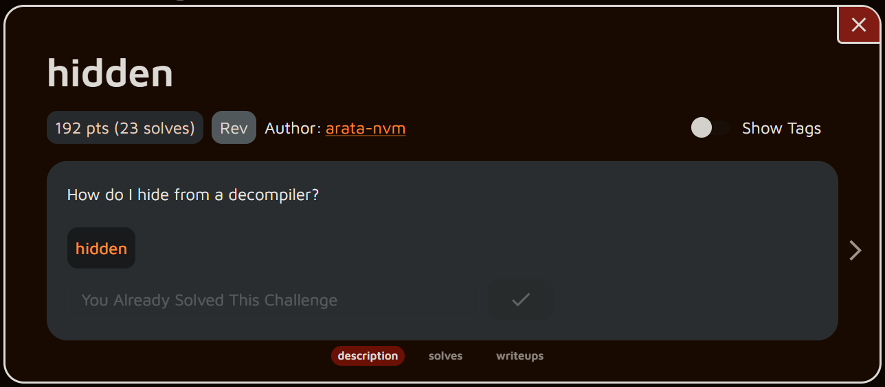
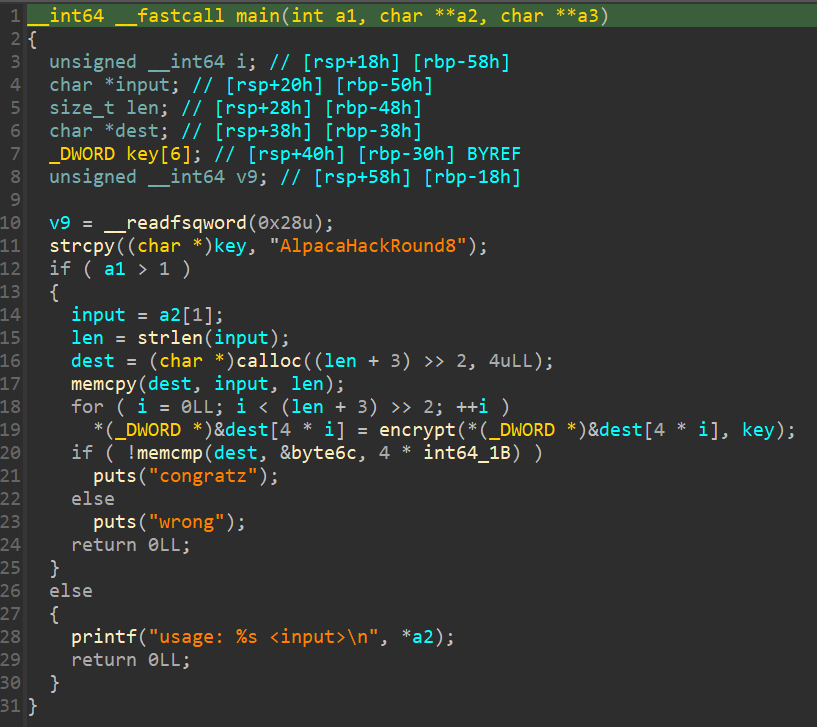
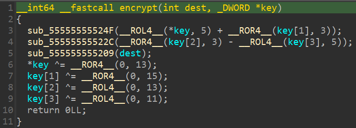
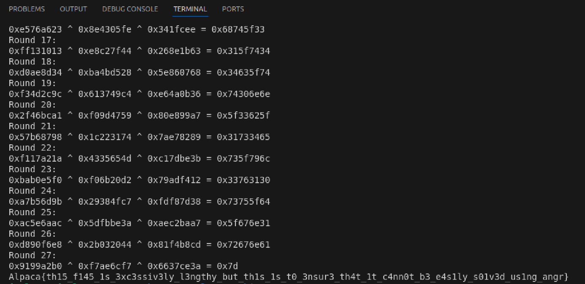

# rev - hidden - Writeup

---  


## FLAG：
`Alpaca{th15_f145_1s_3xc3ssiv3ly_l3ngthy_but_th1s_1s_t0_3nsur3_th4t_1t_c4nn0t_b3_e4s1ly_s01v3d_us1ng_angr}`

## 觀察：
- 執行檔案：輸入input，加密，比對是否為正確的flag
- IDA分析：
	- `main()`：把input轉成27個 int32 再加密、比較。  
	  
	- `encrypt()`：  
	  
	- 觀察可以發現IDA並不能decompile出正確的encrypt function，需要分析assembly。
	  


## 步驟：  

1. 分析encrypt function：
```python
s1 = ROL4(key[0], 5) + ROR4(key[1], 3)
s2 = ROR4(key[2], 3) - ROL4(key[3], 5)
input[i:i+4] ^= s1 ^ s2
if input[i:i+4] % 2:
	key[0] ^= ROL4(s2, 11)
	key[1] ^= ROL4(s2, 13)
	key[2] ^= ROR4(s1, 15)
	key[3] ^= ROR4(s1, 13)
else:
	key[0] ^= ROR4(s2, 13)
	key[1] ^= ROR4(s2, 15)
	key[2] ^= ROL4(s1, 13)
	key[3] ^= ROL4(s1, 11)
```

2. 反向解密

## Exploit：  

```python
from pwn import *
from Crypto.Util.number import *
  
round = 0
  
def ROR4(n, b):
	return (n>>b)+((n<<(32-b))&0xFFFFFFFF)
  
def ROL4(n, b):
	return (n>>(32-b))+((n<<b)&0xFFFFFFFF)
  
rst = [ 0xDC, 0x86, 0x1A, 0x9A, 0xDD, 0x93, 0x9B, 0x35, 0xD3, 0x74,
		0xDA, 0xEE, 0xE8, 0x5A, 0x3C, 0xC5, 0x1C, 0x64, 0x33, 0x47,
		0xD2, 0x3B, 0x28, 0xF3, 0xCC, 0x5A, 0x48, 0x8B, 0x74, 0x0C,
		0x4B, 0x87, 0x38, 0xD6, 0x80, 0x40, 0x51, 0xE6, 0x4A, 0x27,
		0xA1, 0x73, 0x52, 0x0F, 0x93, 0x06, 0x54, 0x3D, 0x65, 0x13,
		0xFB, 0xC8, 0x65, 0xAF, 0xD2, 0x67, 0xB3, 0x09, 0xEF, 0x7D,
		0x23, 0xA6, 0x76, 0xE5, 0x13, 0x10, 0x13, 0xFF, 0x34, 0x8D,
		0xAE, 0xD0, 0x9C, 0x2C, 0x4D, 0xF3, 0xA1, 0xBC, 0x46, 0x2F,
		0x98, 0x87, 0xB6, 0x57, 0x1A, 0xA2, 0x17, 0xF1, 0xF0, 0xE5,
		0xB0, 0xBA, 0x9B, 0x6D, 0xB5, 0xA7, 0xAC, 0x6A, 0x5E, 0xAC,
		0xE8, 0xF6, 0x90, 0xD8, 0xB0, 0xA2, 0x99, 0x91]
key = b'AlpacaHackRound8'
key = [u32(key[i:i+4]) for i in range(0,16,4)]
  
output = [ rst[i] + (rst[i+1]<<8) + (rst[i+2]<<16) + (rst[i+3]<<24) for i in range(0, len(rst), 4)]
flag = []
for out in output:
	round+=1
	print(f"Round {round}:")
	  
	s1 = (ROL4(key[0], 5) + ROR4(key[1], 3)) & 0xFFFFFFFF
	s2 = (ROR4(key[2], 3) - ROL4(key[3], 5)) & 0xFFFFFFFF
	flag.append(out^s1^s2)
	print(f"{hex(out)} ^ {hex(s1)} ^ {hex(s2)} = {hex(flag[-1])}")
	  
	if(out%2):
		key[0] ^= ROL4(s2, 11)
		key[1] ^= ROL4(s2, 13)
		key[2] ^= ROR4(s1, 15)
		key[3] ^= ROR4(s1, 13)
	else:
		key[0] ^= ROR4(s2, 13)
		key[1] ^= ROR4(s2, 15)
		key[2] ^= ROL4(s1, 13)
		key[3] ^= ROL4(s1, 11)
  
print("".join(long_to_bytes(f).decode() for f in flag[::-1])[::-1])
```

