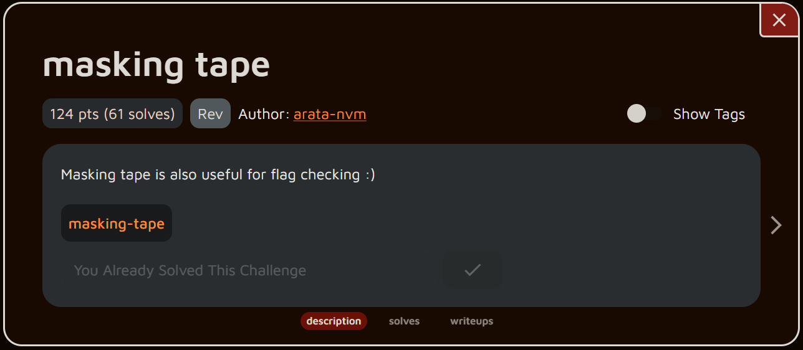
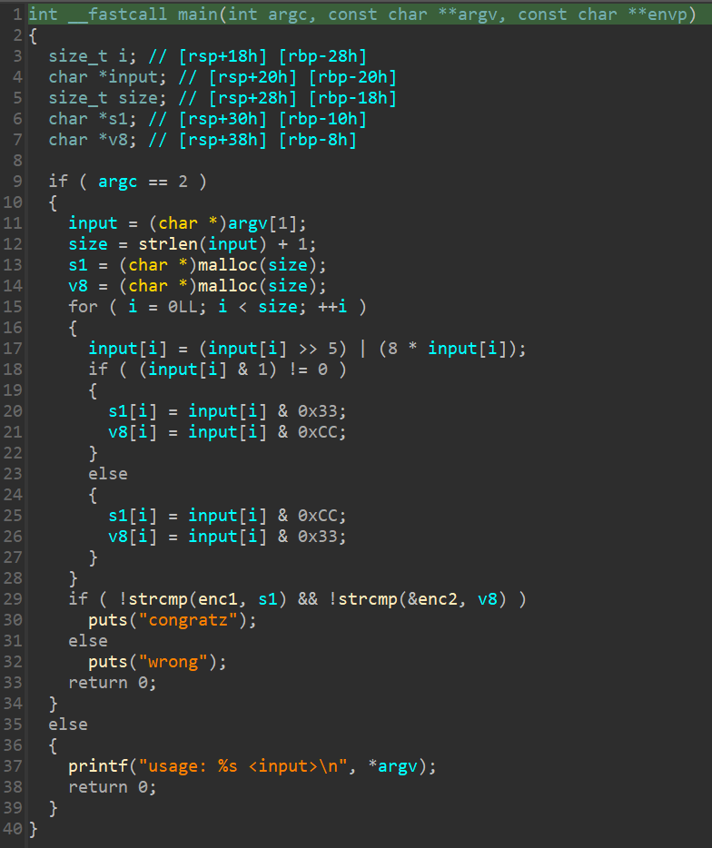
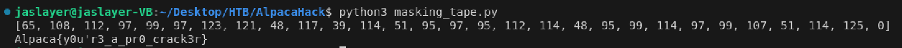

# rev - masking tape - Writeup

---  


## FLAG：
`Alpaca{y0u'r3_a_pr0_crack3r}`

## 觀察：
- 執行檔案：輸入input，檢查正確與否。
- IDA分析：
	- `main()`：  
	  
	- input[i]先進行rotate操作，再依據其奇偶性拆開儲存、比較。


## 步驟：
1. 拆開儲存的部分，將兩堆數據OR起來就可以還原。
2. 還原rotate。

## Exploit：  

```python
enc1 = [0x08, 0x23, 0x03, 0x03, 0x13, 0x03, 0x13, 0x03, 0x01, 0x23,
		0x31, 0x13, 0x11, 0xC8, 0x03, 0xC8, 0x03, 0x13, 0x01, 0xC8,
		0x13, 0x13, 0x03, 0x13, 0x13, 0x11, 0x13, 0x23, 0x00]
enc2 = [0x02, 0x40, 0x80, 0x08, 0x08, 0x08, 0xC8, 0xC8, 0x80, 0x88,
		0x08, 0x80, 0x88, 0x32, 0x08, 0x32, 0x80, 0x80, 0x80, 0x32,
		0x08, 0x80, 0x08, 0x08, 0x48, 0x88, 0x80, 0xC8, 0x00]
  
inp = [a|b for (a,b) in zip(enc1,enc2)]
inp = [(c>>3)+((c<<5)&0xFF) for c in inp]
print(inp)
print("".join(chr(c) for c in inp))
```

